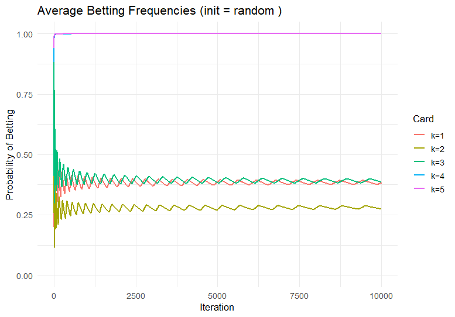

::: callout-note
**Chapter at a glance**

- **Part:** Part V: Game Theory (Advanced / Solvers)
- **Poker topics:** 22 Regret Minimization (CFR), 23 Approximate Equilibria
- **Beyond poker:** online advertising (adaptive bidding), recommender systems (learning from feedback), evolutionary dynamics (learning populations)
:::

## Motivating Example

Solvers do not “solve” poker in one step; they improve by iterated learning. What does “learning” mean mathematically?

**Guiding question.** How can strategies improve over time without knowing the solution in advance?

- Situation: Solvers do not “solve” poker in one step; they improve by iterated learning. What does “learning” mean mathematically?
- Why it matters: this introduces 22 Regret Minimization (CFR) and 23 Approximate Equilibria.

## Mathematical Framework and Poker Theory

### 1. The Structure of a Single-Step Game

We begin with a class of games that are deliberately simple in form, yet rich enough to support meaningful strategic behavior. These games isolate a single moment of decision under uncertainty.

Each player:

- receives private information,
- makes exactly one decision,
- and receives a payoff determined immediately from the combination of information and actions.

There is no notion of “later” in these games—no future streets, no additional opportunities to revise a decision. All strategic tension is compressed into a single choice.

#### The Role of Private Information

Let
$$
T_1, \quad T_2
$$
denote the sets of possible private information (or *types*) for Player 1 and Player 2.

A realization
$$
(t_1,t_2) \in T_1 \times T_2
$$
is drawn according to a known probability distribution
$$
\mathbb{P}(t_1,t_2).
$$

Each player observes only their own type. The opponent’s type must be inferred indirectly through the structure of the game.

#### Running Example: A Five-Card Game

Throughout this section, we use the following model.

The type space for each player is
$$
T_1 = T_2 = \{1,2,3,4,5\}.
$$

Each player is dealt one card uniformly at random **without replacement**, so that
$$
\mathbb{P}(t_1,t_2) = \frac{1}{20}, \quad t_1 \neq t_2.
$$

The ordering
$$
1 < 2 < 3 < 4 < 5
$$
determines hand strength.

#### Actions

At the decision stage, each player chooses an action from the set
$$
A = \{C, B\},
$$
where:

- $C$: check,
- $B$: bet 2 additional chips.

The players act **simultaneously**, so neither observes the other’s action before making their choice.

#### Payoffs

Each player antes 2 chips, so the pot begins at 4.

The payoff to Player 1, denoted
$$
u_1(t_1,t_2,a_1,a_2),
$$
depends on both players’ cards and actions.

The rules are:

- If both players check:
  - the higher card wins 4.
- If both players bet:
  - the higher card wins 8.
- If exactly one player bets:
  - the bettor wins 4.

The game is zero-sum, so
$$
u_2 = -u_1.
$$

#### A Structural Observation

Although the game is simple, two sources of uncertainty are already present:

1. **Uncertainty about the opponent’s type**  
   Each player knows their own card but not the opponent’s.

2. **Uncertainty about the opponent’s action**  
   The opponent’s behavior depends on their private information.

These two forms of uncertainty interact. A decision must account not only for what the opponent *might hold*, but also for how they *might act given what they hold*.

#### Why This Model Matters

At first glance, this game appears elementary: one card, one decision, immediate resolution. Yet it already contains the essential ingredients of strategic reasoning under uncertainty:

- Players must **balance value and bluffing**,
- Optimal decisions depend on **beliefs about opponent behavior**,
- Different types (cards) lead to **different incentives**.

Most importantly for our purposes, the game admits a useful decomposition:

> Each possible type $t_1$ defines its own decision problem.

That is, the question

> “What should I do?”

naturally becomes a collection of smaller questions:

- What should I do with card 1?
- What should I do with card 2?
- $\dots$

This decomposition will be central to counterfactual regret minimization. Rather than solving a single global optimization problem, we will evaluate and update decisions *locally*, one type at a time.

#### Looking Ahead

In the next section, we formalize how players specify behavior across types. From there, we will develop a method for evaluating actions at each type, and ultimately for adjusting strategies based on regret.

Even in this one-step setting, the mathematics will reveal a striking idea:

> Optimal play can emerge from repeatedly asking,  
> “What would have happened if I had chosen differently?”

#### Running Example (5-Card Single-Step Poker)

- Deck:
  $$
  \{1,2,3,4,5\}
  $$
- Each player is dealt one card **without replacement**.
- Each player antes **2 chips** (pot = 4).
- Each player simultaneously chooses:
  $$
  A = \{C, B\}
  $$
  where $B$ is a bet of 2 chips.

#### Payoff Rule

- If both check: highest card wins 4.
- If both bet: highest card wins 8.
- If exactly one bets: bettor wins 4.

#### Definition (Single-Step Bayesian Game)

A single-step game consists of:

- Type spaces:
  $$
  T_1 = T_2 = \{1,2,3,4,5\}
  $$
- Distribution:
  $$
  \mathbb{P}(t_1,t_2) = \frac{1}{20}, \quad t_1 \neq t_2
  $$
- Action set:
  $$
  A = \{C,B\}
  $$
- Payoff function:
  $$
  u_1(t_1,t_2,a_1,a_2)
  $$

The game is zero-sum:
$$
u_2 = -u_1.
$$

### 2. Strategies

We now formalize how a player specifies their behavior across different types.

A strategy must prescribe what to do for **each possible card**, since the player knows their own card at the moment of decision.

#### Definition (Behavior Strategy)

A strategy for Player 1 is a function
$$
\sigma : \{1,2,3,4,5\} \to [0,1],
$$
where
$$
\sigma(k) = \Pr(B \mid k).
$$

That is, for each card $k$, the strategy assigns a probability of betting. The complementary probability
$$
1 - \sigma(k)
$$
is the probability of checking.

Similarly, Player 2 uses a strategy
$$
\tau : \{1,2,3,4,5\} \to [0,1].
$$

#### Deterministic and Mixed Behavior

A strategy is called **pure** if, for every card $k$,
$$
\sigma(k) \in \{0,1\}.
$$

In this case, the player takes a fixed action for each card.

More generally, a strategy is **mixed** (or randomized) if some values satisfy
$$
0 < \sigma(k) < 1.
$$

In this case, the player deliberately randomizes between betting and checking.

#### Why Randomization Appears

At first glance, it may seem unnecessary to randomize: why not simply choose the better action for each card?

The difficulty is that the value of an action depends on the opponent’s expectations. If a player’s behavior becomes predictable, the opponent can respond in a way that exploits it.

Randomization allows a player to:

- conceal information about their card,
- balance strong and weak hands,
- prevent the opponent from making profitable adjustments.

Thus, randomness is not a defect of the model, but a necessary feature of optimal play.

#### Example Interpretation

A strategy might be written as
$$
\sigma = (0.1,\,0.2,\,0.5,\,0.8,\,1.0),
$$
where the entries correspond to cards 1 through 5.

This means:

- With card 1: bet with probability 0.1.
- With card 2: bet with probability 0.2.
- With card 3: bet with probability 0.5.
- With card 4: bet with probability 0.8.
- With card 5: always bet.

#### Interpreting the Structure

This strategy reflects three distinct roles that hands can play:

- **Low cards (e.g., 1, 2):**  
  Betting is typically unprofitable at showdown, so bets function as **bluffs**. The low probability reflects selective bluffing.

- **High cards (e.g., 5):**  
  These hands win at showdown and benefit from building the pot, so betting occurs with high (or full) frequency.

- **Middle cards (e.g., 3, 4):**  
  These hands occupy a more delicate position. Betting can extract value from weaker hands but risks being called by stronger ones. As a result, these hands are often **mixed** between actions.

#### A Vector Representation

It is often convenient to view a strategy as a vector:
$$
\sigma = (\sigma(1),\sigma(2),\sigma(3),\sigma(4),\sigma(5)) \in [0,1]^5.
$$

This representation emphasizes that a strategy is not a single decision, but a collection of decisions—one for each possible card.

#### Structural Observation

A key feature of this model is that strategies decompose across types:

- The choice of $\sigma(3)$ does not directly constrain $\sigma(4)$,
- Each card corresponds to its own decision variable.

This independence will be essential when we introduce regret:

> We will evaluate and update decisions **separately for each card**, rather than attempting to optimize the entire strategy at once.

#### Looking Ahead

With strategies defined, we can now ask:

- What is the expected value of a given strategy?
- How does the value of betting compare to checking for a specific card?

Answering these questions will lead us to **counterfactual values**, which form the foundation of regret-based learning.

### 3. Expected Value

With strategies specified, we now turn to the central quantity of interest: the expected payoff.

Given strategies $\sigma$ for Player 1 and $\tau$ for Player 2, the expected value to Player 1 is

$$
u_1(\sigma,\tau)
=
\sum_{k \neq j} \frac{1}{20}
\sum_{a_1,a_2 \in \{C,B\}}
\Pr(a_1 \mid k)\,\Pr(a_2 \mid j)\,u_1(k,j,a_1,a_2).
$$

Using our notation,
$$
\Pr(a_1 = B \mid k) = \sigma(k), \quad \Pr(a_1 = C \mid k) = 1 - \sigma(k),
$$
and similarly for $\tau(j)$.

#### Interpretation

This expression averages over three sources of randomness:

- The deal of the cards $(k,j)$,
- Player 1’s randomized action,
- Player 2’s randomized action.

It answers the global question:

> “If both players use these strategies, what is my average payoff per hand?”

#### A Structural Decomposition

The expected value can be reorganized by conditioning on Player 1’s card:

$$
u_1(\sigma,\tau)
=
\sum_{k=1}^5 \mathbb{P}(k)\,v(k),
$$

where
$$
\mathbb{P}(k) = \frac{1}{5}
$$
and $v(k)$ is the expected value conditional on holding card $k$.

This decomposition separates:

- **how often a card occurs**, from
- **how valuable that card is under the strategy**.

### 4. Conditional (Card-Specific) Values

We now formalize the quantity $v(k)$, which isolates the decision associated with a single card.

#### Definition (Conditional Value)

Fix a card $k \in \{1,2,3,4,5\}$. The **conditional value** is

$$
v(k)
=
\sum_{j \neq k}
\frac{1}{4}
\sum_{a_1,a_2 \in \{C,B\}}
\Pr(a_1 \mid k)\,\Pr(a_2 \mid j)\,u_1(k,j,a_1,a_2).
$$

Here:

- The factor $\frac{1}{4}$ reflects that, given $k$, the opponent’s card $j$ is uniformly distributed over the remaining four possibilities,
- The inner sum averages over both players’ randomized actions.

#### Interpretation

The quantity $v(k)$ answers a more focused question:

> “Suppose I hold card $k$. What is my expected payoff under the current strategies?”

This removes one layer of randomness—the deal of Player 1’s card—and allows us to study each decision in isolation.

#### Why This Matters

The decomposition
$$
u_1(\sigma,\tau)
=
\frac{1}{5}\sum_{k=1}^5 v(k)
$$
reveals that the global expected value is simply the average of five local quantities.

This perspective is essential:

- The overall performance of a strategy is built from its performance on each card,
- Improvements to the strategy can therefore be made **locally**, one card at a time.

#### Looking Ahead

In the next section, we refine this idea further.

Instead of evaluating the strategy as a whole at card $k$, we will ask:

> “What would happen if I always chose a specific action at this card?”

This leads to the notion of **counterfactual values**, which form the basis for defining regret.
### 5. Counterfactual Values

#### Definition (Counterfactual Value)

Fix a card $k$ and an action $a \in \{C,B\}$. The **counterfactual value**
of action $a$ is

$$
v(k,a)
=
\sum_{j \neq k}
\frac{1}{4}
\sum_{a_2 \in \{C,B\}}
\Pr(a_2 \mid j)\,u_1(k,j,a,a_2).
$$

#### Interpretation

The quantity $v(k,a)$ represents:

- The expected payoff **if Player 1 always plays action $a$ when holding card $k$**,
- While Player 2 continues to play according to strategy $\tau$.

Importantly, this evaluation:

- **ignores Player 1’s current strategy at card $k$**,  
- but still averages over:
  - Player 2’s possible cards,
  - Player 2’s randomized actions.

This is why the term *counterfactual* is used:

> We evaluate what would have happened under a hypothetical change in behavior.

#### Relationship to Conditional Value

Recall that

$$
v(k)
=
\sigma(k)\,v(k,B)
+
(1-\sigma(k))\,v(k,C).
$$

Thus:

- $v(k)$ is the value of the *current mixture*,
- $v(k,a)$ is the value of a *pure deviation*.

#### Example: Explicit Formulas

Let $\tau(j)$ denote the probability that Player 2 bets with card $j$.
Then

$$
\Pr(a_2 = B \mid j) = \tau(j),
\quad
\Pr(a_2 = C \mid j) = 1 - \tau(j).
$$

**Check ($a = C$)**

If Player 1 checks:

- If Player 2 checks: showdown for a pot of 4,
- If Player 2 bets: Player 1 loses 4.

Thus,

$$
v(k,C)
=
\sum_{j \neq k} \frac{1}{4}
\left[
(1-\tau(j)) \cdot \text{SD}_4(k,j)
+
\tau(j)\cdot (-4)
\right].
$$

**Bet ($a = B$)**

If Player 1 bets:

- If Player 2 checks: Player 1 wins 4,
- If Player 2 bets: showdown for a pot of 8.

Thus,

$$
v(k,B)
=
\sum_{j \neq k} \frac{1}{4}
\left[
(1-\tau(j))\cdot 4
+
\tau(j)\cdot \text{SD}_8(k,j)
\right].
$$

#### Showdown Payoffs

$$
\text{SD}_4(k,j) =
\begin{cases}
4 & k>j \\
-4 & k<j
\end{cases}
\qquad
\text{SD}_8(k,j) =
\begin{cases}
8 & k>j \\
-8 & k<j
\end{cases}
$$

### 6. Strategy Value as a Mixture

The conditional value can be written as

$$
v(k)
=
\sigma(k)\,v(k,B)
+
(1-\sigma(k))\,v(k,C).
$$

#### Interpretation

- A mixed strategy is a **weighted average of its actions**,
- The weights are the probabilities assigned by the strategy.

#### A Conceptual Shift

Instead of optimizing $\sigma(k)$ directly:

- Compare $v(k,B)$ and $v(k,C)$,
- Adjust $\sigma(k)$ accordingly.

This is precisely what regret will measure.

#### Looking Ahead

We now ask:

> “How much better would one action have been than what we actually did?”

This leads to **regret**.

### 7. Regret

#### Definition (Instantaneous Regret)

At iteration $t$,

$$
r_t(k,a)
=
v_t(k,a) - v_t(k).
$$

#### Interpretation

For each card $k$:

> “How much better would action $a$ have been?”

#### Sign of Regret

- If
  $$
  r_t(k,a) > 0,
  $$
  then action $a$ would have been better.

- If
  $$
  r_t(k,a) < 0,
  $$
  then action $a$ would have been worse.

#### Example

- For $k=5$:
  $$
  v_t(5,B) > v_t(5,C)
  $$
  → betting has positive regret.

- For $k=1$:
  excessive betting can give
  $$
  v_t(1,B) < v_t(1)
  $$
  → negative regret.

#### Definition (Cumulative Regret)

$$
R_T(k,a)
=
\sum_{t=1}^T r_t(k,a).
$$

#### Interpretation

- Large positive → underused action  
- Negative → overused action  

#### Structural Observation

Regret is computed **independently for each card $k$**.

### 8. Regret Matching

#### Definition (Positive Regret)

$$
R_T^+(k,a) = \max\{R_T(k,a),\,0\}.
$$

#### Update Rule

$$
\sigma^{T+1}(k,a)
=
\begin{cases}
\dfrac{R_T^+(k,a)}{\sum_{a'} R_T^+(k,a')} & \text{if positive regret exists} \\
\dfrac{1}{2} & \text{otherwise}
\end{cases}
$$

#### Interpretation

- Positive regret → increase probability  
- No positive regret → play uniformly  

#### Two-Action Simplification

- If $R_T(k,B) > 0$ and $R_T(k,C) \le 0$:
  $$
  \sigma^{T+1}(k,B) = 1
  $$

- If $R_T(k,C) > 0$ and $R_T(k,B) \le 0$:
  $$
  \sigma^{T+1}(k,B) = 0
  $$

### 9. Decomposition Across Cards

Each card updates independently.

We solve five local problems:

- What should I do with card 1?
- What should I do with card 2?
- $\dots$
- What should I do with card 5?

### 10. Example: First Iteration

Assume

$$
\sigma(k) = \tau(k) = \tfrac{1}{2}.
$$

#### Card $k=5$

- Always wins,
- Betting increases pot.

$$
v(5,B) > v(5,C)
$$

#### Card $k=1$

- Always loses,
- Betting only wins via folds.

### 11. Average Strategy

$$
\bar{\sigma}_T(k,a)
=
\frac{1}{T}
\sum_{t=1}^T \sigma^t(k,a).
$$

#### Interpretation

The quantity $\bar{\sigma}_T(k,a)$ represents:

> The fraction of time that action $a$ is played when holding card $k$,  
> across the first $T$ iterations.

Thus, while $\sigma^t$ may fluctuate from one iteration to the next,  
the average strategy records the **long-run behavior** of the learning process.

#### Why Averaging Is Necessary

The sequence $\{\sigma^t\}$ need not converge pointwise:

- Strategies may oscillate,
- Actions may alternate between overuse and underuse,
- Regret matching responds dynamically to recent outcomes.

However, these fluctuations tend to balance out over time.

The average strategy smooths this behavior and captures the stable structure that emerges from repeated play.

#### A Card-by-Card Perspective

As with regret, the average strategy decomposes across cards:

$$
\bar{\sigma}_T = \big(\bar{\sigma}_T(1),\dots,\bar{\sigma}_T(5)\big).
$$

Each component reflects the long-run behavior for a single card:

- How often do we bet with 1?
- How often do we bet with 2?
- $\dots$

### 12. Convergence

We now connect regret minimization to equilibrium behavior.

#### Definition (Average Regret)

Let the total regret after $T$ iterations be

$$
R_T = \sum_{k \in \{1,\dots,5\}} \sum_{a \in \{C,B\}} R_T(k,a).
$$

The **average regret** is

$$
\frac{R_T}{T}.
$$

#### Theorem (Regret Minimization)

If both players use regret matching and satisfy

$$
\frac{R_T}{T} \to 0 \quad \text{as } T \to \infty,
$$

then the average strategies $\bar{\sigma}_T$ and $\bar{\tau}_T$ approach a Nash equilibrium.

#### Interpretation

The distinction between instantaneous strategies and average strategies is essential.

- The sequence $\sigma^t(k)$ may fluctuate significantly over time,
- Even when learning is working correctly.

What stabilizes is the **average strategy**:

$$
\bar{\sigma}_T(k)
=
\frac{1}{T}
\sum_{t=1}^T \sigma^t(k),
$$

which reflects the long-run behavior induced by regret minimization.

::: {.figure}

:::
**Figure.** Evolution of average betting frequencies $\bar{\sigma}_T(k)$ for $k=1,\dots,5$ under regret matching.

The figure illustrates this phenomenon. While individual updates may oscillate, the average betting frequencies gradually organize into a coherent structure. High cards are played aggressively, low cards mix between bluffing and checking, and middle cards interpolate between these behaviors.

In this sense, equilibrium does not appear suddenly. It emerges as a statistical regularity across repeated adjustments.

#### Interpretation

Vanishing average regret means:

> In hindsight, no single action at any card would have consistently outperformed the strategy that was actually used.

In other words:

- There is no persistent incentive to deviate,
- Each action that is played with positive probability performs approximately as well as the alternatives.

This is precisely the defining property of equilibrium.

#### Connection to the Poker Model

In the five-card game, convergence implies that:

- For each card $k$, the actions $B$ and $C$ become approximately **indifferent** whenever both are used,
- Bluffing frequencies stabilize,
- Value betting frequencies stabilize.

Thus, equilibrium behavior emerges not from solving a global optimization problem, but from repeated local adjustments.

#### Conceptual Summary

The process unfolds in three stages:

1. **Evaluate actions locally** using counterfactual values,  
2. **Accumulate regret** based on missed opportunities,  
3. **Update strategies** via regret matching and average over time.  

The result is a strategy in which:

> No action has accumulated systematic advantage over the ones being played.

#### Looking Ahead

This convergence result extends far beyond this simple model.

In more complex games:

- Types are replaced by information sets,
- Reach probabilities must be tracked,
- But the core logic remains unchanged.

The same principle applies:

> Local regret minimization leads to global strategic balance.

### 13. Poker Interpretation

The mathematical structure we have developed can now be read directly in the language of the game.

In the five-card model:

- A **card** represents a unit of private information,
- A **strategy** specifies how that information is translated into action,
- A **counterfactual value** evaluates what an action would achieve against the opponent’s behavior,
- **Regret** records missed opportunities for improvement.

Thus, the learning process can be understood as a repeated refinement of decisions at each card.

#### Regret as a Feedback Signal

At each iteration, regret provides a localized signal:

- If betting with a given card would have performed better, its regret increases,
- If betting performs worse than the current mixture, its regret decreases (and is eventually ignored).

In this way, regret acts as a memory of past performance, guiding future behavior.

Importantly, this signal is **card-specific**:

> The algorithm does not learn a single global rule.  
> It learns how to act separately with each hand.

#### Emerging Structure

As regret accumulates and strategies are updated, a recognizable pattern begins to form.

- **High cards (e.g., 5):**  
  These hands win at showdown and benefit from building larger pots.  
  Regret quickly favors betting, leading to near-deterministic value betting.

- **Low cards (e.g., 1):**  
  These hands lose at showdown and can only profit through folds.  
  Betting becomes a **bluff**, and regret determines how often bluffing is worthwhile.

- **Middle cards (e.g., 2, 3, 4):**  
  These hands sit between value and bluffing.  
  Betting sometimes extracts value from weaker hands but risks losses against stronger ones.  
  As a result, regret typically drives these hands toward **mixed strategies**.

#### Balance Through Indifference

Over time, the algorithm adjusts play until, for frequently used actions,

$$
v(k,B) \approx v(k,C).
$$

That is, the actions become approximately **indifferent**.

This balance has a clear interpretation:

- If betting were strictly better, its regret would continue to grow,
- If checking were strictly better, the same would occur in the opposite direction,
- Only when the two actions are nearly equal does regret stabilize.

#### A Conceptual Perspective

From a broader viewpoint, the process can be summarized as follows:

- The player repeatedly asks:  
  > “What would have happened if I had chosen differently with this hand?”

- The answer is aggregated over time into regret,

- The strategy evolves to eliminate systematic mistakes.

No explicit calculation of equilibrium is performed. Instead:

> Equilibrium behavior emerges as the point at which no action consistently outperforms the others.

#### Connection to Strategic Thinking

Although derived from a simple model, this framework reflects a deeper principle:

- Good decisions are not judged by outcomes alone,
- They are evaluated relative to **available alternatives**.

In this sense, regret minimization formalizes a disciplined way of learning from experience:

- Not “Did I win or lose?”  
- But “Was there a better decision, given what I knew?”

#### Looking Ahead

In more complex poker models:

- Information is no longer captured by a single card,
- Decisions occur across multiple stages,
- Actions influence what information is revealed later.

Despite this added complexity, the same idea persists:

> Strategic behavior can be built from local comparisons,  
> guided by regret, and refined through repetition.

### 14. Conceptual Summary

Counterfactual regret minimization replaces a global optimization problem with a sequence of local evaluations and updates.

In the single-step setting, this process can be understood through three interacting components:

#### Local Evaluation

For each card $k$, we compute:

- The value of each action:
  $$
  v(k,B), \quad v(k,C),
  $$
- The value of the current strategy:
  $$
  v(k).
  $$

These quantities depend only on:

- the opponent’s behavior,
- the structure of the game.

#### Regret as a Correction Signal

Regret measures the discrepancy between:

- what was done, and
- what could have been done.

For each card and action:

$$
r_t(k,a) = v_t(k,a) - v_t(k).
$$

Accumulating regret over time produces:

$$
R_T(k,a).
$$

#### Iterative Adjustment

Regret matching converts cumulative regret into updated strategies:

- Actions with positive regret are emphasized,
- Actions with negative regret are suppressed,
- Strategies evolve incrementally over time.

#### Emergent Equilibrium

As $T \to \infty$:

- Average regret vanishes,
- Actions that are played become approximately indifferent,
- The average strategy approaches equilibrium.

#### A Unifying Perspective

The entire process can be summarized as:

> Evaluate locally, compare alternatives, and adjust gradually.

### Forward Link: From Cards to Information Sets

The five-card game allowed us to identify each decision with a single piece of information—a card.

In more realistic settings, this simplification breaks down.

#### The Limitation of the Current Model

In this chapter:

- Each card $k$ uniquely determines what the player knows,
- Decisions depend only on that card,
- The game has a single stage.

In general:

- Information is revealed gradually,
- Players must act without knowing all relevant variables,
- The same decision point may arise through multiple histories.

#### The Next Conceptual Step

To extend this framework, we must replace cards with **information sets**:

- Collections of game states that are indistinguishable to the player,
- Each representing a decision under partial information.

We must also track:

- **Reach probabilities**, which describe how play arrives at a decision,
- The interaction between past actions and future opportunities.

#### Toward Full CFR

With these additions:

- Counterfactual values incorporate reach probabilities,
- Regret is computed at information sets,
- Strategy updates follow the same regret-matching principle.

#### Closing Perspective

Even in this simple model, the essential idea is already visible:

> Strategic behavior can be built from local comparisons,  
> guided by regret, and refined through repetition.

The next chapter extends this to sequential games, where decisions unfold over time and information is incomplete—but the underlying logic remains unchanged.

## Homework Problems

1. Compute counterfactual values for a given strategy pair.  
2. Explain the meaning of regret in your own words.  
3. Show why indifference emerges at equilibrium.  
4. *[Problem to be written]*  
5. *[Problem to be written]*  
6. *[Problem to be written]*  

## Extension Activity

Extend the chapter’s main tool using a small simulation or a short written reflection connecting poker to another domain.